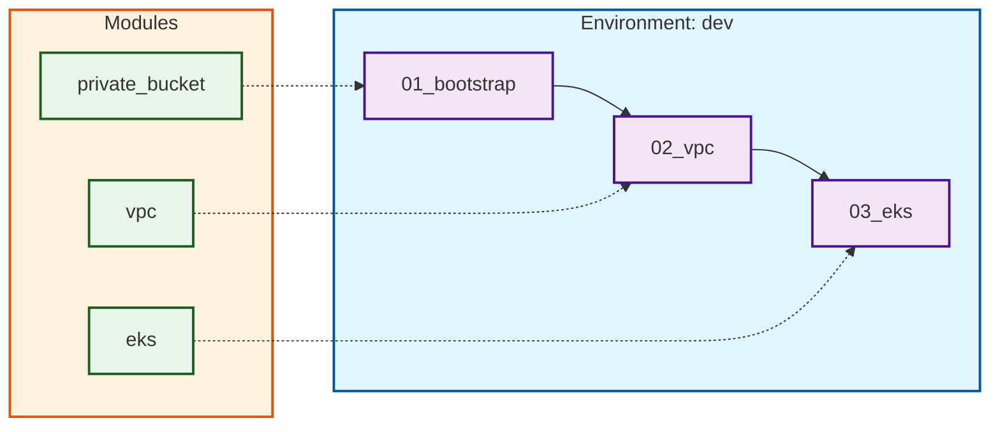

# Automate AWS EKS cluster setup with Karpenter, while utilizing Graviton and Spot instances


Example Terraform project for deploying an AWS EKS cluster with Karpenter autoscaling, supporting both x86 and ARM64 (Graviton) instances.

## Features

- **EKS Cluster**: Deploys a production-ready EKS cluster in a dedicated VPC
- **Karpenter Integration**: Automated node provisioning with support for both x86 and ARM64 architectures
- **Cost Optimization**: Leverages Graviton and Spot instances for better price/performance
- **Multi-Architecture Support**: Run workloads on either x86 or ARM64 nodes based on pod requirements
- **Multiple Environments**: Supports creation of multiple environments (dev, prod, etc.)

## Architecture

The following diagram illustrates the structure of the Terraform codebase:



## Usage

### Initial Setup

1. Prepare your AWS user with access key and secret key (requires appropriate IAM permissions).

2. Deploy the infrastructure:

   ```bash
   AWS_ACCESS_KEY_ID="your-access-key-id" \
   AWS_SECRET_ACCESS_KEY="your-secret-access-key" \
   ./creator.sh
   ```

   This will create the entire infrastructure and generate a `dev.kubeconfig.yaml` file in the root directory.

### Connecting to the Cluster

Connect to the cluster using `k9s`:

```bash
AWS_ACCESS_KEY_ID="your-access-key-id" \
AWS_SECRET_ACCESS_KEY="your-secret-access-key" \
KUBECONFIG=dev.kubeconfig.yaml \
k9s
```

### Deploying Test Workloads

Deploy a test workload on x86 (amd64) nodes:

```bash
AWS_ACCESS_KEY_ID="your-access-key-id" \
AWS_SECRET_ACCESS_KEY="your-secret-access-key" \
KUBECONFIG=dev.kubeconfig.yaml \
kubectl apply -f inflate-amd64.yaml
```

Deploy a test workload on ARM64 (Graviton) nodes:

```bash
AWS_ACCESS_KEY_ID="your-access-key-id" \
AWS_SECRET_ACCESS_KEY="your-secret-access-key" \
KUBECONFIG=dev.kubeconfig.yaml \
kubectl apply -f inflate-arm64.yaml
```

### Adding Regular User Access

To allow a regular user (with ARN `regular_user_arn`) to deploy to a specific namespace (`regular_namespace`):

1. Add the user configuration to `envs/dev/03_eks/main.tf`:

   ```hcl
   module "eks" {
     ...
     user_access_entries = [regular_user_arn]
     user_access_allowed_namespaces = ["default", regular_namespace]
   }
   ```

2. Apply the changes:

   ```bash
   cd envs/dev/03_eks
   terraform apply
   ```

3. Create the namespace (must be done by a user with admin privileges):

   ```bash
   kubectl create namespace regular_namespace
   ```

4. Update the deployment manifest to use the correct namespace. Edit `inflate-arm64.yaml` and change the `namespace` field from `default` to `regular_namespace`:

   ```yaml
   metadata:
     name: inflate-arm64
     namespace: regular_namespace
   ```

5. The regular user can now deploy using their own credentials:

   ```bash
   AWS_ACCESS_KEY_ID="regular-user-access-key" \
   AWS_SECRET_ACCESS_KEY="regular-user-secret-key" \
   KUBECONFIG=dev.kubeconfig.yaml \
   kubectl apply -f inflate-arm64.yaml
   ```

### Cleaning Up Infrastructure

To clean up all created infrastructure (except the state bucket itself), run:

```bash
AWS_ACCESS_KEY_ID="your-access-key-id" \
AWS_SECRET_ACCESS_KEY="your-secret-access-key" \
./cleaner.sh
```

## Highlights

- The `_bootstrap` stack is used only for managing the S3 bucket where Terraform stack states are stored. We create a private bucket for storing Terraform states with `force_destroy = true`. In a real project, this option should be disabled for additional bucket protection.

- The `01_bootstrap` stack creates a state file that stores only a pointer to the Terraform state bucket for all subsequent steps (stacks). This state file should be committed to the repository (this is safe, as it contains no secrets or keys).

- We use symbolic links `%stack_name%/_bootstrap.auto.tfvars -> 01_bootstrap/_main.auto.tfvars` to use the same `env`, `random_suffix` and `aws_region` in every stack.

- For the dev deployment, we use **fck-nat** by default (a cost-effective NAT solution). To use regular AWS NAT Gateway instead, set `nat_type = "regular"` in `envs/dev/02_vpc/main.tf`.

- Karpenter controller nodes are protected with a taint (`karpenter.sh/controller=true:NoSchedule`) to prevent other workloads from being scheduled on them. All system components (Karpenter, CoreDNS, EKS Pod Identity Agent, Metrics Server) have proper tolerations configured to run on these dedicated nodes.

- To create a second environment (e.g., `prod`), create a folder `envs/prod` and copy the contents from `envs/dev`. This content is a thin wrapper layer split into separate states (bootstrap, VPC, EKS) to reduce blast radius, and it uses modules from the `modules/` directory. After copying, update `_main.auto.tfvars` in `01_bootstrap` to set the correct `env`, `random_suffix`, and `aws_region` values for the new environment.

## Known Issues

- **Unexpected attribute error**: "An attribute named 'cluster_name' is not expected here"

  If you are using VSCode/CursorIDE together with OpenTofu (official) 0.6.0, it cannot (presumably) correctly parse the Karpenter submodule when it is called from your module.
